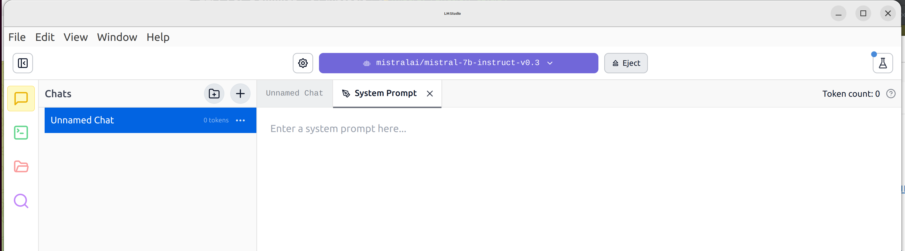
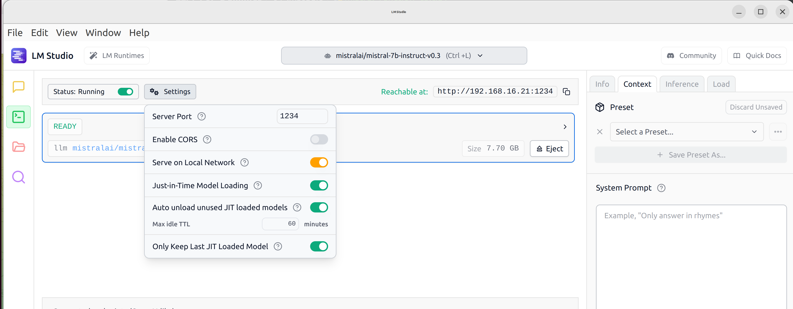
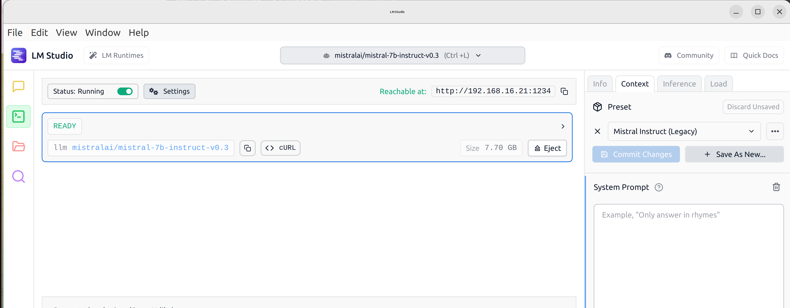
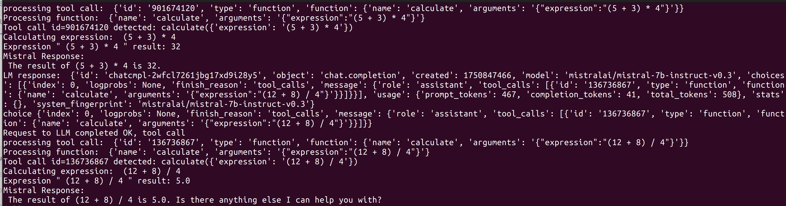

This sample demonstrates use of function call in Mistral model.

# LM Studio Function Calling Demo

This demo project shows how to:
- Run the [`mistralai/mistral-7b-instruct-v0.3`](https://huggingface.co/mistralai/mistral-7b-instruct-v0.3) model locally using [LM Studio](https://lmstudio.ai/)

  this model based on mistral model fine tuned on https://huggingface.co/datasets/glaiveai/glaive-function-calling-v2 dataset

- Call the model from a Python script using its local API

- Use **external function calling** to handle arithmetic expressions (e.g., `2 * (3 + 4)`) in Python and return the result back to the model

---

## 🔧 Prerequisites

- Python 3.10+
- LM Studio (desktop app)
- `requests` Python package

Install the dependencies:

```bash
pip install requests
```
It is recommended to use Conda and Mamba to set up environments to avoid conflicts

Links:
https://anaconda.org/
https://anaconda.org/conda-forge/mamba


in LM Studio, load and select mistralai/mistral-7b-instruct-v0.3 model and open ports:



and then open ports:



Download mistral context config from https://github.com/lmstudio-ai/configs.git

and select it in LM Studio for mistral model:




## Code logic


Specifying function in the tools object (json):

```
{
    "type": "function",
    "function": {
        "name": "calculate",
        "description": "Evaluate a simple math expression",
        "parameters": {
            "type": "object",
            "properties": {
                "expression": {
                    "type": "string",
                    "description": "Math expression like '2 + 2 * (3 + 1)'"
                }
            },
            "required": ["expression"]
        }
    }
}
```

In the messages section, we provide "magic" prompt and user request (prompt variable):

```
{"role": "system", "content": "You are a helpful assistant. Use tools when needed."},
{"role": "user", "content": prompt}
```

Model (functions) trained on https://huggingface.co/datasets/glaiveai/glaive-function-calling-v2 dataset that uses system prompt like this, that why we repeat it:

`SYSTEM: You are a helpful assistant with access to the following functions. Use them if required`

Complete request structure:

```
payload = {
    "model": "mistralai/mistral-7b-instruct-v0.3",
    "messages": messages,
    "tools": tools,
    "tool_choice": "auto",
    "temperature": 0.7,
    "max_tokens": 512
}
```

First prompt we send contains question to calculate math expression:

"What's the result of (5 + 3) * 4?"`

Model analyzes it, detects function usage and send response with choice structure back to us:

`choice {'index': 0, 'logprobs': None, 'finish_reason': 'tool_calls', 'message': {'role': 'assistant', 'tool_calls': [{'id': '645989719', 'type': 'function', 'function': {'name': 'calculate', 'arguments': '{"expression":"(5 + 3) * 4"}'}}]}}`

in the choice object, we should parse and calculate function call with name "calculate", id "645989719" and arguments {"expression":"(5 + 3) * 4"}

`Calculating expression:  (5 + 3) * 4
Expression " (5 + 3) * 4 " result: 32`

Next, we update messages in payload and send updated payload request to LM Studio with function evaluation result:

```
messages.append({
    "role": "assistant",
    "tool_calls": [tool_call]
})
messages.append({
    "role": "tool",
    "tool_call_id": tool_call_id,
    "name": tool_name,
    "content": result
})
```

and LLM model returns answer with function result embedded:

`The result is 32. Is there anything else you need help with?`

Terminal with debug messages:


 